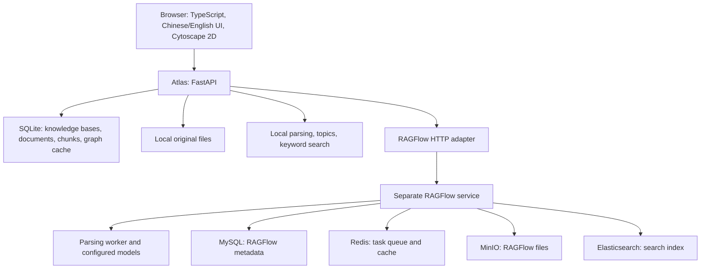

# Atlas architecture

Implementation snapshot: 2026-10-08. This document describes the current MVP. Features marked **proposed** are not implemented. See [PRODUCT.md](PRODUCT.md) for user goals and [the Linux guide](../deploy/LINUX.md) for installation commands.

## 1. System boundaries

Atlas organizes source documents, exposes searchable excerpts, and displays relationships with their sources. It can run independently or use a separate RAGFlow service for document processing and semantic retrieval.

For example, a Chinese document containing `[[张伟]] --负责--> [[知识图谱项目]]` produces a relationship that the user can click to inspect the source. The relationship comes from the author's explicit annotation. Local mode does not ask an AI model to invent relationships.

The MVP is a single-user application. A knowledge base separates projects, but does not enforce user permissions. Both Atlas and the native RAGFlow profile use local application endpoints; the Linux guide uses SSH forwarding for browser access.



Atlas SQLite and RAGFlow MySQL have different responsibilities. Installing RAGFlow does not replace Atlas's database.

## 2. Code organization

The table describes the full development repository. The Linux ZIP / `.tar.gz` includes backend source and compiled `dist/` assets, but omits `frontend/`, `tests/`, `run.sh` and Node build files. Frontend paths below identify source modules; they are not files supplied in the deployment package. Start that package with `scripts/install-linux.sh` followed by `scripts/start-linux.sh`, using `deploy/atlas.env`.

| Component | Responsibility |
|---|---|
| [backend/main.py](../backend/main.py) | FastAPI routes, upload/background processing, sync, source scoping, static frontend serving |
| [backend/config.py](../backend/config.py) | Environment configuration, storage location, upload limit, RAGFlow settings |
| [backend/store.py](../backend/store.py) | SQLite schema, persistence, local original files |
| [backend/knowledge.py](../backend/knowledge.py) | Local extraction, chunking, topics, lexical ranking, graph construction and normalization |
| [backend/ragflow.py](../backend/ragflow.py) | Remote dataset/document/retrieval calls and optional legacy graph calls through `httpx` |
| `frontend/main.ts` (development checkout only) | Document library, search, graph explorer, source inspector, API calls |
| `frontend/i18n.ts`, `frontend/zh-CN.json` (development checkout only) | Interface translation and language preference |
| `frontend/highlight.ts` (development checkout only) | Search-term highlighting, including Chinese terms |
| [scripts/](../scripts/) and [deploy/](../deploy/) | Native installation, systemd setup, migration, release packaging and deployment checks |

The frontend is built with Vite. FastAPI serves `dist/index.html` and its assets in the release. The Atlas Linux runtime therefore does not need Node.js. Development uses the Vite server with an API proxy.

## 3. Data model and ownership

The default storage root is `data/`; `KB_DATA_DIR` overrides it. SQLite uses WAL mode and enables foreign keys. Original uploads are stored under generated document IDs rather than user-supplied paths.

| Table / storage | Main fields and purpose |
|---|---|
| `knowledge_bases` | Local ID, name, description, engine (`local` or `ragflow`), optional remote dataset ID, graph task status/error |
| `documents` | Local ID, knowledge-base ID, original name, size, status, progress, error, optional remote document ID, topics |
| `chunks` | Local ID, document ID, ordinal, text, optional PDF page, optional remote chunk ID, keywords |
| `graphs` | One cached JSON graph per knowledge base, update timestamp |
| `data/files/{document_id}` | Original uploaded bytes |

A knowledge base owns documents; each document owns chunks. Deleting a document cascades to its chunks and invalidates the cached graph. Document operations check that the document belongs to the selected knowledge base. This is consistent project scoping, not authentication.

Local IDs remain Atlas's identifiers. Remote IDs connect them to RAGFlow objects. Documents discovered through remote sync have metadata and chunks but may have no local original file, so Atlas cannot offer a local download for those files.

## 4. Document processing

### Local engine

1. Validate the upload, save the original file, and create a `queued` document. The upload endpoint returns HTTP 202.
2. An in-process FastAPI background task extracts text from Markdown, TXT, PDF or DOCX.
3. Split text into chunks of up to 1,000 characters with 100-character overlap, preferring newline/space boundaries where possible. Local PDF chunks retain their page number.
4. Derive topics from headings and explicit `[[references]]`; use frequent keywords when named topics are absent.
5. Save chunks/topics and mark the document `ready`; report parsing errors as `failed`.

Uploads are limited to 20 MiB. Extraction also bounds PDF pages, extracted text and expanded DOCX size. Scanned PDFs without readable text fail with guidance to use OCR through RAGFlow. DOCX paragraphs and tables are supported; images, footnotes and original layout are not preserved.

Background work is not a durable queue. On restart, interrupted `queued` uploads are marked failed and can be retried. Run one Atlas worker with the provided service profile.

### RAGFlow engine

1. Create a remote dataset or attach an existing accessible dataset. Atlas prevents attaching the same dataset twice locally and rejects custom ingestion pipelines.
2. Save the upload locally, forward it to RAGFlow, and request parsing.
3. Use **Refresh** to fetch remote documents, processing status and available chunks. Sync also discovers documents uploaded directly to that dataset.
4. Map remote IDs to local records. Remote deletion removes the corresponding local document and invalidates the graph cache.

Sync uses pagination, with limits enforced by the adapter. Ready document chunks are replaced during sync, so their local chunk IDs can change. Remote chunk IDs are retained for source resolution. Sync is not an incremental change feed or a scheduled webhook consumer. Remote parsing jobs continue in RAGFlow when Atlas stops.

## 5. Retrieval and Chinese support

Local search scans knowledge-base chunks and ranks them using BM25-style keyword scoring. Chinese character bigrams support matching text without requiring spaces. This is lexical retrieval, not embeddings or semantic question answering. Results are source excerpts, not generated answers.

RAGFlow search calls its retrieval API with the selected dataset ID and returns ranked chunks. Chinese semantic retrieval depends on a Chinese-capable embedding model configured in RAGFlow. Atlas does not install a chat/embedding model server.

The interface defaults to Simplified Chinese and can switch to English. The preference is stored as `atlas.language` in browser local storage. Content, filenames and graph labels retain their original language. Markdown/TXT parsing accepts UTF-8, UTF-16 with a BOM, and GB18030; PDF/DOCX text retains Unicode.

## 6. Graph model and evidence

The backend exposes a renderer-independent `nodes` / `edges` graph. Nodes have IDs, labels, types, descriptions, source-document IDs and an origin. Edges have IDs, source/target IDs, a relation, descriptions, source-document IDs and an origin. Unresolved supplied references remain in `source_refs`. Local annotation edges can also carry `source_chunks` for precise highlighting.

For example, this import supplies a relationship but no evidence:

```json
{
  "nodes": [
    {"id": "zhang", "label": "张伟", "type": "person"},
    {"id": "project", "label": "知识图谱项目", "type": "project"}
  ],
  "edges": [
    {"source": "zhang", "target": "project", "relation": "负责"}
  ]
}
```

Adding `source_documents` using actual local document IDs, remote document IDs or synced remote chunk references lets Atlas resolve sources in that knowledge base. A supplied reference that cannot be resolved is shown as unresolved; it does not become a verified citation.

There are three graph paths:

| Path | Behavior and meaning |
|---|---|
| Local document/topic map | Generated from ready documents. `covers` means a document contains a topic. Literal annotations produce authored relationship edges. |
| JSON import | Normalize supplied nodes/edges and source references. Import replaces the displayed graph; it does not merge it into the local map. Reset restores the document/topic map. |
| Legacy RAGFlow graph API | Optional remote build/fetch through older graph endpoints, enabled by `RAGFLOW_LEGACY_GRAPH_API=true`. Missing endpoints return compatibility errors. |

Imports accept `edges` or `links`, nested `data.graph`, and supported RAGFlow entity fields. Invalid duplicate node IDs and dangling edges are rejected. Limits are 5 MiB JSON, 2,000 nodes and 5,000 edges. Origin labels distinguish imported, local and remote graph data; none of these labels alone proves a statement true.

Newer RAGFlow artifact operations are not fully automated by this adapter. Where a RAGFlow release can export graph JSON, import provides a portable path. See the [README compatibility details](../README.md#ragflow-graph-compatibility).

### 2D now; optional 3D proposed

The shipped graph explorer uses Cytoscape in 2D: pan/zoom, filters, node/edge selection, neighbor focus, layout changes and a source inspector. It has no depth coordinate, camera or 3D toggle. Layout coordinates are display state, not persisted knowledge.

A **proposed** 3D view can reuse the same node IDs, edges and source resolver. A renderer such as [3d-force-graph](https://github.com/vasturiano/3d-force-graph), built on Three.js/WebGL, accepts nodes and links with source/target identifiers. A frontend adapter would copy the normalized nodes and convert `edges` to `links`; layout engines may mutate those copies. The renderer would calculate `x/y/z` and expose camera controls while existing selection opens the same source inspector. Basic 3D display does not require a new backend or graph database.

Keep 2D as the default for reading Chinese labels and checking citations. Add 3D as an optional exploration mode only after validating label legibility, keyboard interaction and performance on representative graphs. Depth is a layout choice: `张伟 → 负责 → 知识图谱项目` means the same thing in either view. No 3D implementation is included in this MVP.

The [dedicated 3D proposal](3D_PROPOSAL.md) specifies 3D nodes/connections with flat screen-facing labels, prioritizing a projected HTML overlay for readable Chinese text. It covers collision handling, shared selection/source behavior, fallback and acceptance criteria. Screen-facing labels solve orientation; overlapping projected labels still require explicit handling.

## 7. API surface

Paths below are under `/api`; `{kb}` means the local knowledge-base ID. FastAPI's interactive API reference is at `/docs` while the app runs.

| Routes | Purpose |
|---|---|
| `GET /health`, `GET /config` | SQLite health and public feature/configuration flags; no credentials |
| `GET/POST /knowledge-bases` | List/create knowledge bases |
| `GET/POST /knowledge-bases/{kb}/documents` | List/upload documents |
| `GET .../documents/{doc}`, `GET .../download` | Inspect chunks or download an available local original |
| `POST .../documents/{doc}/retry`, `DELETE .../documents/{doc}` | Retry failures or remove documents; active processing blocks removal |
| `POST /knowledge-bases/{kb}/sync` | Synchronize remote documents and chunks |
| `GET .../topics`, `GET .../graph` | Topic grouping and normalized graph |
| `POST/DELETE .../graph/import` | Import a graph or restore the document/topic map |
| `POST .../graph/build`, `POST .../graph/sync` | Optional legacy RAGFlow graph task operations |
| `POST .../search` | Retrieve excerpts using the selected engine |

`ragflow_configured` means the URL and key are present. It does not confirm network reachability, valid credentials, models or successful parsing. `/health` checks Atlas/SQLite, not the full RAGFlow stack.

## 8. Native Linux deployment and connection

The prepared target is **Ubuntu 24.04 x86_64 without Docker**. The release includes built Atlas assets, hashed Python dependencies, documentation, and native service scripts. The [version manifest](../deploy/native-versions.json) pins RAGFlow v0.22.1 and its supporting profile. This older Python service chain is a compatibility baseline, not the newest RAGFlow deployment.

| Service | Default local port |
|---|---|
| Atlas | 8000 |
| RAGFlow management UI | 8080 |
| RAGFlow API / admin API | 9380 / 9381 |
| MySQL | 3306 |
| Dedicated Redis | 6381 |
| MinIO / console | 9000 / 9001 |
| Elasticsearch | 9200 |

Systemd runs Atlas and the separate RAGFlow API, worker, admin, sync and web services. RAGFlow files/index/cache have their own `/var/lib/ragflow-*` locations. Generated native service secrets are stored in root-readable `/etc/ragflow-native/secrets.json`; Atlas's API key stays in its backend environment. See the deployment guide for exact owners, paths and installation guards.

Connecting is a separate step from installing:

1. Install and verify the native services using the [Linux guide](../deploy/LINUX.md).
2. Open the RAGFlow UI through SSH forwarding, configure models and create a RAGFlow account API key. A model-provider key is a different credential.
3. Set `RAGFLOW_BASE_URL=http://127.0.0.1:9380` and `RAGFLOW_API_KEY` in Atlas's environment; restart Atlas.
4. Create an Atlas knowledge base using the RAGFlow engine, upload a small Chinese document, refresh until ready and test retrieval.

The Linux service explicitly selects `deploy/atlas.env` through `ATLAS_ENV_FILE`; local development defaults to `.env`. The native installer does not provision the embedding/chat model service. Full native installation and actual document parsing have **not been executed on the development Mac** and remain destination-server acceptance work.

## 9. Backup, verification and next engineering work

[Migration scripts](../scripts/migrate-data.sh) create a SQLite backup and bundle original files. Stop the source app to keep files consistent. Restore refuses to overwrite existing target data. Runtime environments and credentials are excluded. A backup of Atlas does not back up RAGFlow's databases, index, object storage or account keys; those need separate migration.

The existing automated suite, available in the full development checkout rather than the release, covers local ingestion, graph normalization, source scoping, retrieval, persistence, Chinese matching, deployment configuration and mocked RAGFlow contracts. Frontend checks cover language/highlighting behavior. These checks do not establish a successful native Linux install or compatibility with every live RAGFlow version. The packaged build script also requires the full checkout; its presence in the release does not make the release rebuildable.

Before a shared deployment, add authentication and document permissions enforced in all API and retrieval paths. Replace in-process upload work with durable jobs, make sync incremental, and measure search/graph performance against larger real collections. Optional 3D belongs in the presentation layer and should follow successful source/evidence workflows.
